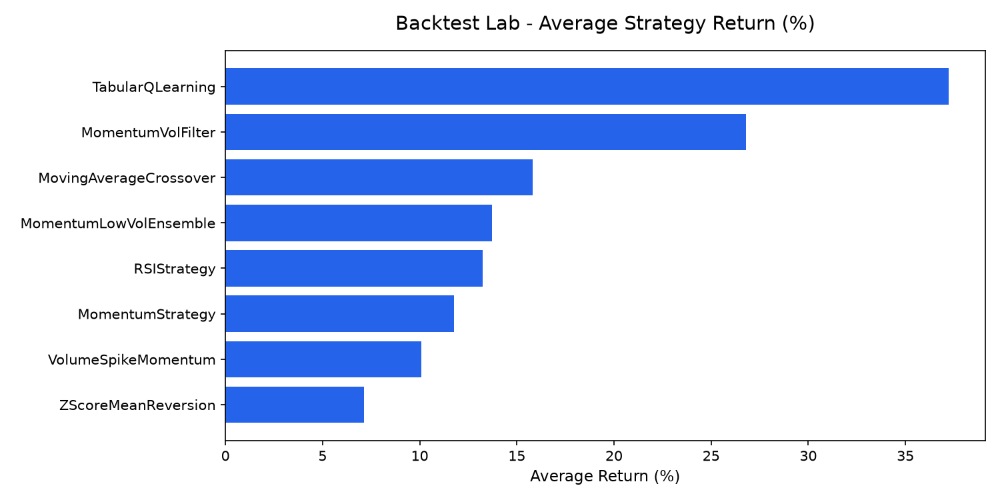

# backtest-lab

Quantitative backtesting engine with transaction costs, market-aware annualisation, and out-of-sample validation across 23 equity and crypto assets.



## Why

Backtests that omit execution friction, use incorrect trading calendars, or report only in-sample best performers create severe data-snooping bias. `backtest-lab` provides a verifiable testing framework with transaction costs, risk-free rate excess returns, and explicit out-of-sample verification across equities and crypto. Execution timing and look-ahead bias fixes were contributed in PR #1.

## How it works

- Local caching for yfinance historical market data downloads
- 13 rule-based strategies executed with independent object states per worker
- Next-bar close trade execution with 0.10% commission and 0.05% slippage
- Market-aware annualisation using 252 days for equities and 365 days / 24 hours for crypto
- Annualised Sharpe ratio with a 4% risk-free rate hurdle
- 70/30 chronological in-sample to out-of-sample evaluation split

## Results

Command: `python main.py`

Combinations tested: 598

| Asset | Interval | Picked on in-sample | IS Sharpe | OOS Sharpe | OOS return | Buy & hold OOS |
|---|---|---|---|---|---|---|
| AAPL | 1d | LowVolTrend | 1.10 | -0.23 | -4.1% | 95.1% |
| ADA-USD | 1d | MomentumStrategy | 1.30 | -0.04 | -28.8% | -48.6% |
| AMC | 1d | MACDStrategy | 0.57 | 0.16 | -20.0% | -65.3% |
| AMZN | 1d | LowVolTrend | 0.83 | 0.29 | 26.1% | 106.4% |
| ATOM-USD | 1d | MomentumStrategy | 0.79 | -0.98 | -73.9% | -74.5% |
| BNB-USD | 1d | MomentumStrategy | 1.44 | 0.43 | 41.7% | 153.4% |
| BTC-USD | 1d | MomentumStrategy | 1.51 | 0.68 | 87.4% | 197.8% |
| DOGE-USD | 1d | MomentumStrategy | 1.08 | 0.60 | 80.7% | 13.3% |
| DOT-USD | 1d | MovingAverageCrossover | 1.02 | -1.41 | -75.6% | -89.4% |
| ETH-USD | 1d | MomentumStrategy | 1.05 | 0.38 | 35.6% | 12.2% |
| FET-USD | 1d | MovingAverageCrossover | 1.42 | -0.40 | -54.7% | -87.2% |
| GOOGL | 1d | ZScoreMeanReversion | 0.68 | 0.49 | 40.2% | 162.0% |
| LINK-USD | 1d | MACDStrategy | 1.35 | 0.05 | -24.5% | -26.7% |
| META | 1d | MovingAverageCrossover | 0.81 | 0.49 | 51.2% | 138.9% |
| MSFT | 1d | ZScoreMeanReversion | 0.68 | 0.17 | 17.2% | 69.8% |
| NEAR-USD | 1d | MomentumVolFilter | 1.35 | 1.29 | 232.8% | 7.4% |
| NVDA | 1d | VolumeSpikeMomentum | 0.82 | 1.15 | 171.0% | 433.0% |
| PLTR | 1d | ZScoreMeanReversion | 1.16 | 1.30 | 149.3% | 155.2% |
| QQQ | 1d | MomentumStrategy | 0.60 | 0.38 | 26.9% | 114.9% |
| SOL-USD | 1d | MovingAverageCrossover | 1.64 | -0.20 | -27.2% | -32.0% |
| SPY | 1d | BollingerBandsStrategy | 0.35 | 0.92 | 56.3% | 89.8% |
| TSLA | 1d | MomentumStrategy | 1.08 | 0.35 | 34.1% | 45.3% |
| XRP-USD | 1d | MACDStrategy | 0.96 | 0.35 | 25.2% | 181.4% |
| AAPL | 1h | MomentumVolFilter | 0.82 | -0.62 | -10.2% | 20.5% |
| ADA-USD | 1h | MovingAverageCrossover | 0.49 | -0.53 | -17.5% | -3.4% |
| AMC | 1h | CombinedMACDRSI | 0.16 | 0.67 | 26.1% | 28.0% |
| AMZN | 1h | BollingerBandsStrategy | 1.03 | -0.25 | -3.5% | 13.1% |
| ATOM-USD | 1h | MomentumStrategy | 0.03 | -1.36 | -31.4% | -6.8% |
| BNB-USD | 1h | MomentumVolFilter | 0.15 | 0.63 | 10.9% | 18.4% |
| BTC-USD | 1h | CombinedMACDRSI | 0.00 | 0.00 | 0.0% | 18.0% |
| DOGE-USD | 1h | MomentumLowVolEnsemble | 0.68 | -0.61 | -14.2% | -6.4% |
| DOT-USD | 1h | MomentumStrategy | -0.14 | 0.04 | -3.4% | -26.7% |
| ETH-USD | 1h | BollingerBandsStrategy | 0.13 | 0.16 | 1.9% | 23.9% |
| FET-USD | 1h | VolumeSpikeMomentum | 0.17 | 0.34 | 0.6% | 28.4% |
| GOOGL | 1h | TabularQLearning | 1.03 | 0.34 | 8.9% | 9.2% |
| LINK-USD | 1h | VolRegimeSwitch | 0.03 | -2.14 | -39.7% | 47.1% |
| META | 1h | VolumeSpikeMomentum | 0.84 | -0.65 | -13.8% | 7.3% |
| MSFT | 1h | VolumeSpikeMomentum | 0.35 | -0.50 | -10.9% | 10.0% |
| NEAR-USD | 1h | MovingAverageCrossover | -0.16 | 1.45 | 65.0% | 293.8% |
| NVDA | 1h | MomentumLowVolEnsemble | 1.42 | 0.35 | 8.2% | 30.2% |
| PLTR | 1h | TabularQLearning | 1.98 | 0.34 | 6.8% | 6.9% |
| QQQ | 1h | TabularQLearning | 0.78 | 1.03 | 20.3% | 21.0% |
| SOL-USD | 1h | BollingerBandsStrategy | 0.02 | 0.24 | 3.4% | 33.6% |
| SPY | 1h | TabularQLearning | 0.97 | 0.85 | 12.7% | 13.2% |
| TSLA | 1h | TabularQLearning | 1.03 | -0.37 | -16.7% | -17.1% |
| XRP-USD | 1h | MomentumLowVolEnsemble | 1.76 | -0.14 | -5.0% | 2.3% |

Across the 46 evaluated combinations, the median in-sample Sharpe ratio was 0.83 while the median out-of-sample Sharpe ratio fell to 0.27, demonstrating performance shrinkage under out-of-sample evaluation.

## Quickstart

```bash
python -m venv .venv
source .venv/bin/activate  # On Windows: .venv\Scripts\activate
pip install -r requirements.txt pytest
python main.py
```

## Tests

```bash
pytest -q
```

## Limitations

- Long-only model without short execution or funding/borrow costs
- Single 70/30 chronological split rather than a rolling walk-forward test
- Survivorship bias inherent in evaluating currently active tickers
- Execution based on next-bar close without intraday order-book depth

## How I used AI

I used Antigravity to draft parts of the code. I chose the design, reviewed every change, rewrote the strategy evaluation and annualisation engine, and wrote the tests in tests/ to check it. Agent-made commits are visible in the history.

## License

MIT License. See [LICENSE](LICENSE) for details.
